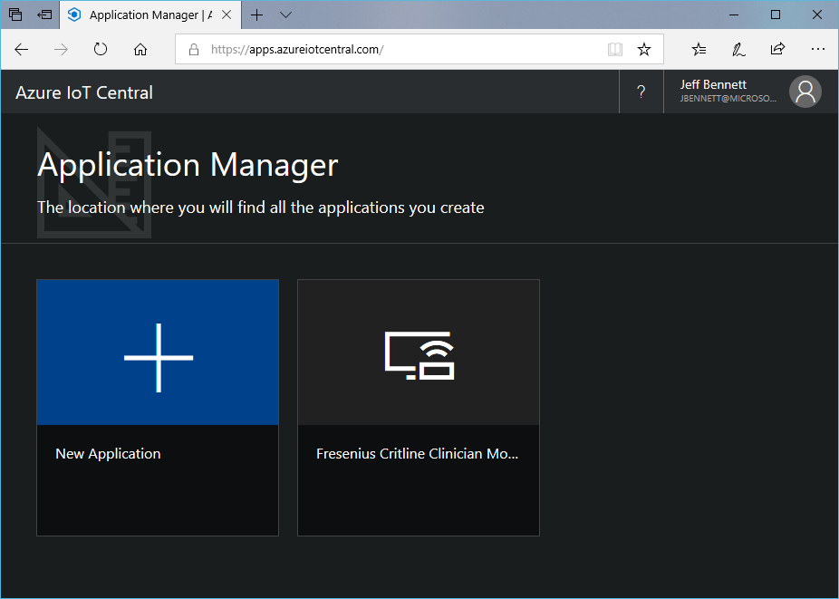

# Creating Your First IoT Central App

- [Creating Your First IoT Central App](#creating-your-first-iot-central-app)
    - [Create the IoT Central App](#create-the-iot-central-app)
    - [Next steps](#next-steps)

## Create the IoT Central App

As a builder, you use the Azure IoT Central UI to define your Microsoft Azure IoT Central application. This quickstart shows you how to create an Azure IoT Central application that contains a sample device template and simulated devices.

- [ ] Navigate to the [Azure IoT Central Application Manager](https://apps.azureiotcentral.com/) page.
- [ ] Then enter the email address and password you use to access your Azure subscription.

Enter your organization account

To start creating a new Azure IoT Central application, choose New Application:



- [ ] Choose the Paid payment plan.
    ```text
    NOTE - Currently you can use up to 5 devices in IoT Central for free.  If you select the Free payment plan, your trial will only last 7 days.
    ```
- [ ] Choose a friendly application name.
    -  Azure IoT Central generates a unique URL prefix for you. You can change this URL prefix to something more memorable.
- [ ] Choose the Sample Devkits template.
    ```text
    NOTE - The Sample Devkits template provides a completed device template for the MXChip board.
- [ ] Then choose Create.


## Next steps

Now that we've created our IoT Central app, we can focus on connecting our MXChip board to IoT Central.  Click [here](ConnectingTheMXChip.MD) to begin!